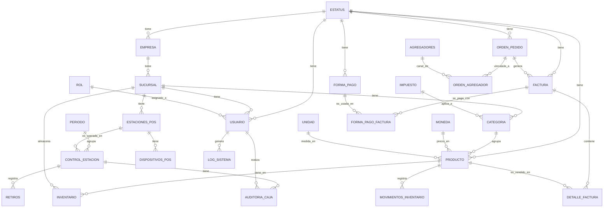

# Documentación de la Base de Datos - Prunus

Este documento describe la arquitectura de datos, relaciones y reglas de negocio del sistema Prunus.

## 1. Diagrama Entidad-Relación (ERD)

## 2. Diccionario de Datos

### 2.1 Tablas Maestras y Configuración

#### `estatus`
Centraliza los estados lógicos de todos los módulos.
- `id_status` (PK): Identificador único (UUID).
- `std_descripcion`: Nombre del estado (Activo, Inactivo, Cerrado, etc.).
- `stp_tipo_estado`: Categoría (PRODUCTO, FACTURA, USUARIO).
- `mdl_id`: ID del módulo asociado.

#### `empresa`
Información legal de la entidad principal.
- `id_empresa` (PK): Identificador único (UUID).
- `nombre`: Razón social.
- `rut`: Identificación tributaria (Único).

#### `sucursal`
Ubicaciones físicas de la empresa.
- `id_sucursal` (PK): Identificador único (UUID).
- `id_empresa` (FK): Empresa a la que pertenece.
- `nombre_sucursal`: Nombre comercial de la sede.

#### `usuario`
Credenciales y datos de personal.
- `id_usuario` (PK): Identificador único (UUID).
- `email`: Correo electrónico (Login).
- `password`: Hash de la contraseña.
- `id_rol` (FK): Perfil de permisos.
- `id_sucursal` (FK): Sede asignada.

### 2.2 Inventario y Productos

#### `producto`
Definición global de artículos.
- `id_producto` (PK): Identificador único (UUID).
- `nombre`: Nombre del producto.
- `id_categoria` (FK): Categoría asociada.
- `id_moneda` (FK): Moneda base.
- `id_unidad` (FK): Unidad de medida.

#### `inventario`
Gestión de existencias y precios por sede.
- `id_inventario` (PK): Identificador único (UUID).
- `id_producto` (FK): Producto asociado.
- `id_sucursal` (FK): Sede donde reside.
- `stock_actual`: Cantidad disponible.
- `precio_venta`: Precio de venta en esta sucursal.

### 2.3 Operaciones POS y Auditoría

#### `control_estacion` (Caja)
Sesiones de apertura y cierre de punto de venta.
- `id_control_estacion` (PK): Identificador único (UUID).
- `id_estacion` (FK): Punto físico de venta.
- `fecha_apertura`: Inicio de turno.
- `saldo_inicial`: Efectivo base.

#### `log_sistema`
Traza de auditoría de acciones de usuario.
- `id_log` (PK): Identificador único (UUID).
- `id_usuario` (FK): Quién realizó la acción.
- `accion`: Descripción del cambio (INSERT, UPDATE, DELETE).
- `tabla`: Tabla afectada.
- `registro_id`: ID del registro modificado.

#### `agregadores`
Plataformas externas de delivery (UberEats, Rappi, etc.).
- `id_agregador` (PK): Identificador único (UUID).
- `nombre`: Nombre del canal externo.

## 3. Reglas de Negocio

1.  **Soft Delete:** Ningún registro se elimina físicamente. Se utiliza la columna `deleted_at`. Las consultas deben incluir siempre `WHERE deleted_at IS NULL`.
2.  **Multisede:** Los precios y el stock son independientes por sucursal. Un producto puede estar activo en una sucursal e inactivo en otra.
3.  **Auditoría:** Todas las tablas incluyen `created_at` y `updated_at`. Los cambios críticos se registran en `log_sistema`.
4.  **Seguridad:** Las contraseñas se almacenan cifradas con `bcrypt`. El acceso se valida mediante JWT y el contexto de sucursal (`id_sucursal`) es obligatorio para filtrar datos.

## 4. Estándares Técnicos
- **Motores:** PostgreSQL 15+.
- **Tipos de Datos:** 
    - Identificadores: `UUID` con generación aleatoria.
    - Dinero: `NUMERIC(12,2)` o `DECIMAL(18,2)`.
    - Fechas: `TIMESTAMP` con zona horaria (UTC).
    - Flexibilidad: `JSONB` para campos de configuración o metadatos de agregadores.
