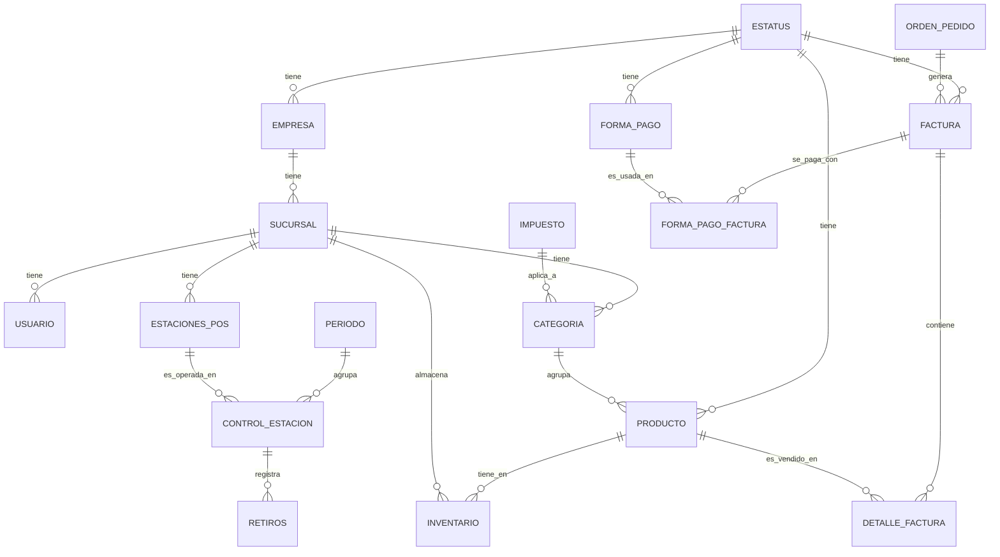

# Documentación de la Base de Datos - Prunus

Este documento describe la arquitectura de datos, relaciones y reglas de negocio del sistema Prunus.

## 1. Diagrama Entidad-Relación (ERD)

## 2. Diccionario de Datos

### 2.1 Tablas Maestras

#### `estatus`
Centraliza los estados lógicos de todos los módulos.
- `id_status` (PK): Identificador único.
- `std_descripcion`: Nombre del estado (Activo, Inactivo, Cerrado, etc.).
- `stp_tipo_estado`: Categoría (PRODUCTO, FACTURA, USUARIO).
- `mdl_id`: ID del módulo asociado.

#### `empresa`
Información legal de la entidad principal.
- `id_empresa` (PK): Identificador único.
- `nombre`: Razón social.
- `rut`: Identificación tributaria (Único).
- `id_status` (FK): Estado actual.

#### `sucursal`
Ubicaciones físicas de la empresa.
- `id_sucursal` (PK): Identificador único.
- `id_empresa` (FK): Empresa a la que pertenece.
- `nombre_sucursal`: Nombre comercial de la sede.

#### `producto`
Definición global de artículos.
- `id_producto` (PK): Identificador único.
- `nombre`: Nombre del producto.
- `id_categoria` (FK): Categoría asociada.
- `id_status` (FK): Estado global.
- *Nota: Precios y stock se gestionan en `inventario` por sucursal.*

### 2.2 Tablas de Operación (POS)

#### `factura`
Documento de venta final.
- `id_factura` (PK): Identificador único.
- `fac_numero`: Numeración legal (Único).
- `cfac_total`: Valor total cobrado.
- `id_status` (FK): Estado (Pagada, Anulada).
- `metadata`: Campo JSONB para datos extensibles (Facturación electrónica, etc.).

#### `inventario`
Gestión de existencias y precios por sede.
- `id_inventario` (PK): Identificador único.
- `id_producto` (FK): Producto asociado.
- `id_sucursal` (FK): Sede donde reside.
- `stock_actual`: Cantidad disponible.
- `precio_venta`: Precio de venta en esta sucursal.

## 3. Reglas de Negocio

1.  **Soft Delete:** Ningún registro se elimina físicamente. Se utiliza la columna `deleted_at`. Las consultas deben incluir siempre `WHERE deleted_at IS NULL`.
2.  **Multisede:** Los precios y el stock son independientes por sucursal. Un producto puede estar activo en una sucursal y "Agotado" o "Inactivo" en otra.
3.  **Auditoría:** Todas las tablas incluyen `created_at` y `updated_at`. Los cambios críticos se registran en `log_sistema`.
4.  **Pagos Mixtos:** Una factura puede ser pagada con múltiples métodos (ej: parte efectivo, parte tarjeta) a través de la tabla `forma_pago_factura`.
5.  **Integridad de Estados:** No se pueden realizar operaciones sobre registros cuyo `id_status` represente un estado "Inactivo" o "Cerrado".

## 4. Estándares Técnicos
- **Motores:** PostgreSQL 15+.
- **Tipos de Datos:** 
    - Dinero: `NUMERIC(12,2)` o `DECIMAL(18,2)`.
    - Fechas: `TIMESTAMP` con zona horaria por defecto (UTC).
    - Flexibilidad: `JSONB` para campos de configuración o metadatos variables.
